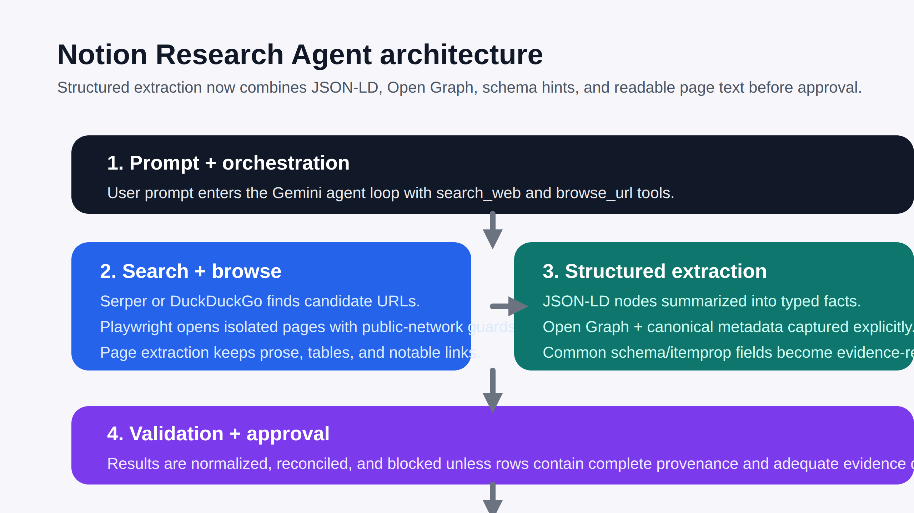

# Notion Research Agent

Notionmcp is a **private, single-operator research workstation**. It is optimized for **reviewed research runs, controlled Notion writes, and auditability**. It is **not a multi-tenant SaaS**.

## Repository profile

- **Description**: Private operator research workstation for durable Gemini web research and audited Notion writes.
- **Topics**: `nextjs`, `gemini`, `notion`, `mcp`, `playwright`, `web-research`, `human-in-the-loop`, `private-operator-tool`
- **Release tags**: `v0.2.1` (worker path + remote encryption hardening), `v0.2.x` (stability and evidence hardening). Mirror these in GitHub releases/tags so operators can verify what build they are running, and keep `CHANGELOG.md` aligned with each tag.

## What this repository is

This repository is a **small runnable Next.js app** for a Notion research workflow built with **Next.js, Gemini, Playwright, and Notion provider adapters**. It is intended as a **private operator tool, not a public SaaS offering**.

It contains the core application pieces:

- a React chat-style UI (`app/components/ChatUI.tsx`)
- a streaming research API route (`app/api/research/route.ts`)
- a streaming Notion write API route (`app/api/write/route.ts`)
- a Gemini agent loop (`lib/agent.ts`)
- Playwright browsing helpers (`lib/browser.ts`)
- a Notion provider layer (`lib/notion/index.ts`)
- a local MCP compatibility wrapper (`lib/notion-mcp.ts`)

The repository is laid out as a standard Next.js App Router project, so `npm install`, `npm run dev`, and `npm run build` work once your environment variables are configured. The default Notion path now talks directly to Notion's official REST API with the operator token you already configure. The pinned local `@notionhq/notion-mcp-server` package remains available as an explicit compatibility mode instead of being the only transport.

To quickly crawl the repository and print its current state, run:

```bash
npm run status
```

Add `-- --json` if you want the same information as structured JSON.

## How it works

1. **You type a research prompt** (e.g. "Find the top 5 competitors to Linear")
2. **A durable job** is created immediately for research or write work and persisted under `.notionmcp-data/jobs`
3. **Gemini 2.0 Flash** plans the research, Playwright extracts normalized evidence documents, and a verifier synthesizes supported rows
4. **The app validates and normalizes** the model payload before the approval UI ever renders it
5. **You review** the structured data and proposed Notion schema
6. **One click** writes everything to Notion via the configured provider mode, with continuous row checkpoints

The UI now exposes two reviewed research lanes:

- **Fast lane** — the current default path with the existing low-latency evidence budget
- **Deep research** — a reviewed mode with higher evidence caps, domain-diversity minimums, and source-class balancing before approval

The write path clamps Notion `title`, `rich_text`, and `url` values to Notion-safe lengths before page
creation so oversized model output cannot fail the whole write.

Each Notion write now uses a deterministic per-row operation key, persists row-level provenance metadata
when the database supports the operator columns, performs a reconciliation pass after ambiguous partial
failures before telling the operator where to resume, and checkpoints the active row pointer continuously
inside the durable job record so reconnects do not restart the append.

After the write completes, the UI gives you a standard `https://www.notion.so/...` link. That link
can be opened in a browser or shared into the Notion app on Android.

### Using it effectively on Android

1. Run your research normally and write the results to Notion.
2. On the success screen, tap **Open in Notion** first.
3. If Android keeps the link in your browser instead of jumping into the app, use **Share link** or
   **Copy Android/web link**.
4. Open that same `https://www.notion.so/...` link from the Notion app or from Android's share
   sheet.

## Stack

- **LLM**: Gemini 2.0 Flash (free via Google AI Studio)
- **Search + browsing**: Serper, Brave, and DuckDuckGo provider support, plus Playwright for page browsing
- **Notion integration**: Direct Notion API by default, optional local MCP compatibility mode
- **Frontend**: Next.js 15 with streaming SSE

When the app falls back to DuckDuckGo HTML search, the UI now labels that run as degraded mode instead of
silently pretending it still has API-backed search quality.

### Durable job behavior

Both `/api/research` and `/api/write` now create a persisted job record and stream job events in reconnectable
windows. Closing the tab no longer discards the run. When the UI reconnects, it resumes from the same job ID and
replays any missed events from the job log before continuing to stream live output.

### Trust boundary

```text
Operator prompt
  ↓ trusted
Planner model
  ↓
Search results + browser extraction
  ↓ untrusted web content boundary
EvidenceDocument[]
  ↓ constrained verifier prompt
Validated research rows
  ↓ operator review
Notion provider
```

The browser layer now labels extracted fields as untrusted evidence, validates redirect hops, fails closed on
non-HTML content types, and strips instruction-like text before the verifier sees it.

### Notion provider modes

`app/api/write/route.ts` now talks to a provider layer under `lib/notion/` instead of binding directly
to the local subprocess transport.

- **`direct-api` (default)** — use the configured operator token against Notion's official REST API
- **`local-mcp`** — keep using the bundled `@notionhq/notion-mcp-server` subprocess only as a legacy compatibility fallback

The direct API path is the default because this repo is optimized for a private operator workflow with a
single reviewed write lane. The local MCP transport stays available, but it is no longer the architectural spine
and should be treated as quarantined compatibility plumbing rather than the canonical path.

## Setup

### 1. Clone and install

```bash
git clone https://github.com/CrisisCore-Systems/Notionmcp.git
cd Notionmcp
npm install
# ↑ also runs `playwright install chromium` via postinstall
```

> **Current status:** the app boots with the included App Router structure. The Gemini and Notion features require valid environment variables, and the API routes will return clear setup errors until those are provided.

### 2. Configure environment variables

```bash
cp .env.example .env.local
```

Fill in `.env.local`:

| Variable | Where to get it |
|---|---|
| `GEMINI_API_KEY` | [aistudio.google.com/apikey](https://aistudio.google.com/apikey) — free, no credit card |
| `SERPER_API_KEY` | Optional. [serper.dev](https://serper.dev) — enables one stable API-backed search provider |
| `BRAVE_SEARCH_API_KEY` | Optional. [search.brave.com](https://search.brave.com/) — enables a second API-backed search provider path |
| `SEARCH_PROVIDERS` | Optional. Comma-separated provider order such as `serper,brave,duckduckgo` |
| `NOTIONMCP_DEPLOYMENT_MODE` | Optional explicit deployment mode. `localhost-operator` is the default; set `remote-private-host` for intentional remote private hosting |
| `APP_ALLOWED_ORIGIN` | Optional. Exact origin to allow when you intentionally expose the API beyond localhost |
| `APP_ACCESS_TOKEN` | Optional. Shared secret required for any non-local API access |
| `APP_RATE_LIMIT_MAX` / `APP_RATE_LIMIT_WINDOW_MS` | Optional remote private-mode rate limiting for API routes |
| `NOTION_TOKEN` | [notion.so/profile/integrations](https://www.notion.so/profile/integrations) — create internal integration |
| `NOTION_PARENT_PAGE_ID` | Open a Notion page → copy the 32-char ID from the URL |
| `NOTION_API_VERSION` | Optional override. Defaults to the pinned `2025-09-03` Notion API version used by both provider modes |
| `NOTION_PROVIDER` | Optional provider mode. `direct-api` is the default; set `local-mcp` only for the legacy subprocess compatibility path |
| `NOTION_MCP_COMMAND` / `NOTION_MCP_ARGS` | Optional local MCP replacement command and JSON-array args |
| `WRITE_AUDIT_DIR` | Optional server-side directory for persisted write audit JSON records |
| `WRITE_AUDIT_RETENTION_DAYS` | Optional retention window before old write-audit JSON files are removed. Defaults to 30 |
| `JOB_STATE_DIR` | Optional server-side directory for persisted research/write job state |
| `JOB_STATE_RETENTION_DAYS` | Optional retention window before old durable-job JSON files are removed. Defaults to 30 |
| `PERSISTED_STATE_ENCRYPTION_KEY` | Optional for localhost, required for any remote private deployment so persisted job/audit state is encrypted at rest |
| `NOTIONMCP_RUN_JOBS_INLINE` | Optional escape hatch for inline debugging. Leave unset for the default detached durable-job mode |

**Important**: Your Notion integration must have access to the parent page.
Go to the page in Notion → `...` menu → `Connect to` → select your integration.

By default, `/api/research` and `/api/write` run in **`localhost-operator`** mode and only accept local
requests. If you intentionally deploy the app for tightly controlled private use, set
`NOTIONMCP_DEPLOYMENT_MODE=remote-private-host` together with **all three** of `APP_ALLOWED_ORIGIN`,
`APP_ACCESS_TOKEN`, and `PERSISTED_STATE_ENCRYPTION_KEY`, then send the matching token in either the
`x-app-access-token` header or a `Bearer` token. Cross-origin requests are rejected either way, and the app
now refuses to boot remote private-host mode unless detached durable jobs remain enabled. The built-in UI
includes an optional access-token field for that private remote mode; leave it blank for normal localhost
use. Review drafts can be enabled per browser session from the UI, stay off by default for privacy, and
expire automatically after 7 days when enabled.

The Notion provider layer pins the `Notion-Version` header to `2025-09-03` by default so the app does not
silently drift with ambient API defaults. If you intentionally test a newer Notion API release, set
`NOTION_API_VERSION` explicitly in `.env.local`. Leave `NOTION_PROVIDER` unset for the default direct API
mode, or set `NOTION_PROVIDER=local-mcp` only if you intentionally want the bundled subprocess fallback.

Every write now also persists a server-side JSON audit record outside transient UI state and returns a
download link from the completion panel. The same completion panel now also links to the persisted durable
job JSON so operators can inspect checkpoints, replayable event history, and the final result/error record as
a first-class proof surface. By default those records live under `.notionmcp-data/write-audits` and
`.notionmcp-data/jobs` in the project root, or you can redirect them with `WRITE_AUDIT_DIR` and
`JOB_STATE_DIR`. The matching API proof endpoints are `/api/write-audits/{auditId}` and `/api/jobs/{jobId}`.
Old persisted job and audit JSON files are cleaned up automatically after 30 days by default via
`JOB_STATE_RETENTION_DAYS` and `WRITE_AUDIT_RETENTION_DAYS`. Local-only setups can leave persisted state
unencrypted, but any remote private deployment must set `PERSISTED_STATE_ENCRYPTION_KEY` so those JSON files
stay encrypted at rest.

### 3. Run

```bash
npm run dev
```

Open [http://localhost:3000](http://localhost:3000)

### Validation scripts

The repository now exposes the core checks directly:

```bash
npm run lint
npm run typecheck
npm test
npm run build
npm run verify
```

The automated tests cover request-security rules, durable job persistence, write-payload normalization and
boundary validation, duplicate fingerprinting, retry helpers, the reconnectable SSE stream parser, browser
URL blocking guards, and smoke-level 400-path checks for both API routes.

## Deployment boundary and risk profile

This app is designed first as a **local or tightly controlled private operator tool**, not as an
open public SaaS endpoint. The current guards around request origin, shared-token access, browser
URL vetting, and resumable writes make that local/private mode much safer, but they are not a full
substitute for production-grade containment.

If you choose to deploy it beyond localhost, treat that as a private environment with additional
hardening requirements. The app now models that as an explicit deployment boundary:

- **`localhost-operator`** — local workstation mode; fastest path for a single trusted operator
- **`remote-private-host`** — remote private-host mode; fails closed unless remote access controls,
  persisted-state encryption, and detached durable jobs are all configured

Remote private-host mode still requires these operational controls:

- run it on a long-lived Node host with persistent local storage whenever detached durable jobs are enabled
- keep `APP_ALLOWED_ORIGIN` and `APP_ACCESS_TOKEN` configured together
- add your own rate limiting, request logging, and operational monitoring
- isolate browser automation so arbitrary page ingestion cannot reach sensitive internal systems
- scope the Notion integration to the smallest practical permission set and parent page

Until those controls exist, the recommended stance is: **local/private tool first, public
deployment only after additional hardening**.

The app now also renders a runtime banner when detached durable jobs are enabled so operators do not mistake
the default deployment posture for a stateless hobby deploy.

## Example prompts

- "Find the top 5 competitors to Notion in the productivity space"
- "Research the best free open-source React component libraries with GitHub stars"  
- "List the top VC firms focused on AI startups with portfolio info"
- "Find recent AI papers on reasoning and tool use from arXiv"
- "Research job postings for senior React engineers at Series B startups"

## Architecture



- [Architecture doc](docs/architecture.md)
- [SVG source](docs/architecture-overview.svg)

```
User prompt
    ↓
Durable research job
    ├── planner → search queries
    ├── extractor → Search + Playwright → EvidenceDocument[]
    └── verifier → supported rows + rejected row reasons
    ↓
Runtime validation + reconciliation
    ↓
Human approval UI ← YOU REVIEW HERE
    ↓
Durable write job
    └── Notion provider layer
        ├── direct-api (default)
        └── local-mcp (compatibility mode)
           with deterministic operation keys, row retries, reconciliation, continuous row checkpoints,
           and resumable job streaming
    ↓
Notion database ✅
```

## Failure and resume walkthrough

1. Start a research or write run.
2. The route creates a persisted job ID immediately.
3. If the browser tab closes or the SSE window rotates, the detached worker keeps running.
4. Re-open the UI and it reconnects to the active job, replaying missed updates from the persisted event log.
5. For writes, the job checkpoint stores the last confirmed row index, so the next worker resume starts from the
   next unresolved row instead of replaying the whole append.

After completion, the UI exposes both the write-audit JSON and the durable-job JSON so the operator can prove
what evidence was used, what rows were attempted, and where the resumable worker checkpoint ended.

## Example write audit shape

```json
{
  "status": "complete",
  "providerMode": "direct-api",
  "databaseId": "db_123",
  "resumedFromIndex": 147,
  "nextRowIndex": 300,
  "message": "✅ Added 153 rows to the existing Notion database",
  "auditTrail": {
    "rowsAttempted": 153,
    "rowsConfirmedWritten": 153,
    "rowsSkippedAsDuplicates": 0,
    "rowsLeftUnresolved": 0
  }
}
```

## Trust artifact surface

The durable write lane now leaves behind two operator-facing proof artifacts:

1. **Write audit JSON** — source set, extraction counts, row outcomes, operation keys, duplicate skips, and unresolved rows
2. **Durable job JSON** — queued/running/complete status, replayable event log, checkpoints, worker heartbeat, final result, and resumable state

That proof surface is visible from the completion panel and persists independently of the browser tab, which is
the main trust differentiator in this repository compared with typical “research agent to Notion” demos.

## Threat model notes for hostile web content

- redirect hops are revalidated as public `http(s)` destinations
- non-HTML responses fail closed before extraction
- evidence is normalized into explicit evidence fields instead of handing semi-raw page blobs to the verifier
- instruction-like page text is stripped before downstream model use
- unsupported rows are rejected with explicit reasons instead of being silently repaired into existence

## Known limits

- The job worker is optimized for a private operator deployment and persists state on the local filesystem rather
  than an external queue or database.
- Detached job workers assume a long-lived Node host. If you move to an ephemeral/serverless runtime, you should
  replace the local worker launcher with a platform-native durable execution system.

## Short roadmap

- [x] Ship a runnable Next.js + Gemini + Notion MCP workflow
- [x] Add retry-aware writes, duplicate handling, and write resume support
- [x] Validate per-row provenance and evidence density before approval or write
- [ ] Add richer source reconciliation and side-by-side evidence inspection in the approval UI
- [ ] Add optional export/import flows for saved research batches
